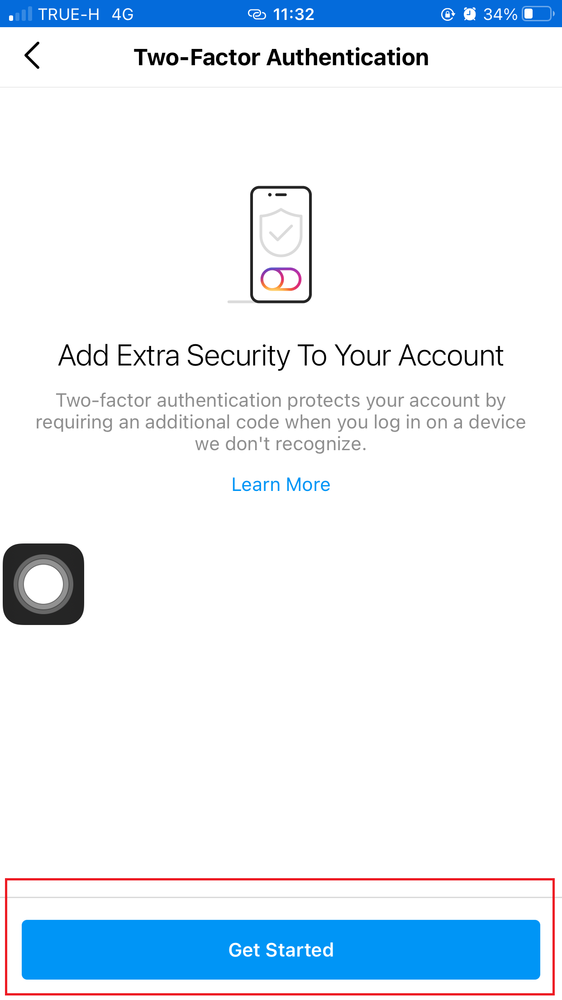

<h2>Two-Factor Authentication on Instagram</h2> 
 วิธีการเปิด Two-Factor Authentication บน Instagram
 1.เปิดแอพ Instagram และเลือกปุ่มรูปคน (Profile) มุมขวาล่าง จากนั้นกดตรงปุ่ม 3 ขีดที่มุมขวาบน และเลือก Settings ตามรูปที่วงสีแดง
 
 2.เข้าไปที่เมนู Security ตามรูปภาพ 
 
 3.หลังจากนั้นเข้าไปที่เมนู Two-Factor Authentication
 
 4.เราสามารถตั้งค่าการยืนยันตัวตนชั้นที่ 2 ได้ 2 วิธี ระหว่างการยืนยันโค้ดจาก SMS (Text Message) หรือการใช้แอพช่วยยืนยันตัวตน (เช่น Google Authenticator) แต่ในตัวอย่างนี้ใช้การยืนยันโค้ดจาก SMS (Text Message)
 
 5.ยืนยันตัวตนผ่าน SMS
 
 6.หากเรากดเปิดใช้งานแบบ Text Message สิ่งที่ต้องทำมีเพียงรอรับ SMS จากเบอร์โทรศัพท์ที่เราตั้งค่าไว้ในบัญชี Instagram แล้วกรอกตัวเลข 6 หลัก เท่านี้ก็เรียบร้อยแล้ว
 
 7.เมื่อเปิดระบบ Two-Factor Authentication ครบหมดแล้วก็จะเห็นหน้าจอดังภาพ
 
 8.เมื่อเปิดระบบ Two-Factor Authentication ให้ลองทดสอบ Two-Factor Authentication on Instagram ผ่าน Web Browser ตามรูป
 
 9.ก็จะสามารถเข้าสู่ Instagram ได้แล้ว
 

  
