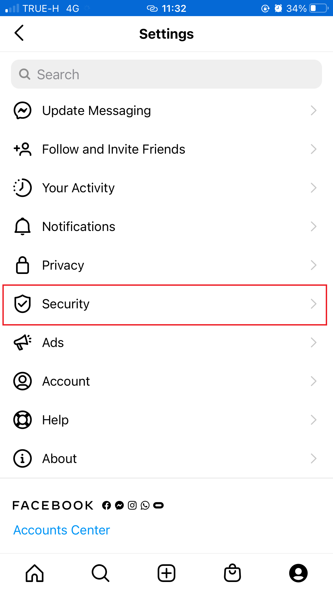

<h2>Two-Factor Authentication on Instagram</h2> 
 วิธีการเปิด Two-Factor Authentication บน Instagram
 1.เปิดแอพ Instagram และเลือกปุ่มรูปคน (Profile) มุมขวาล่าง จากนั้นกดตรงปุ่ม 3 ขีดที่มุมขวาบน และเลือก Settings ตามรูปที่วงสีแดง
    
 2.เข้าไปที่เมนู Security ตามรูปภาพ 
   
 3.หลังจากนั้นเข้าไปที่เมนู Two-Factor Authentication
   
 4.เราสามารถตั้งค่าการยืนยันตัวตนชั้นที่ 2 ได้ 2 วิธี ระหว่างการยืนยันโค้ดจาก SMS (Text Message) หรือการใช้แอพช่วยยืนยันตัวตน (เช่น Google Authenticator) แต่ในตัวอย่างนี้ใช้การยืนยันโค้ดจาก SMS (Text Message)
   
ยืนยันตัวตนผ่าน SMS
เป็นวิธีที่ทุกคนคุ้นเคยเพราะใช้งาน SMS OTP กันเป็นประจำอยู่แล้ว หากเรากดเปิดใช้งานแบบ Text Message สิ่งที่ต้องทำมีเพียงรอรับ SMS จากเบอร์โทรศัพท์ที่เราตั้งค่าไว้ในบัญชี Instagram แล้วกรอกตัวเลข 6 หลัก เท่านี้ก็เรียบร้อยแล้ว (ในอนาคตถ้าจะล็อกอิน Instagram ที่อื่นหรือในมือถือเครื่องอื่น ก็กรอกรหัสผ่านแล้วรอกรอกโค้ดจาก SMS เช่นกัน)

ยืนยันตัวตนผ่าน Authentication App
การยืนยันตัวตนผ่าน SMS ยังมีช่องโหว่ เพราะอาจถูกดักข้อความ SMS ระหว่างทางได้ (เป็นช่องโหว่ของระบบ SMS ที่เราไม่สามารถป้องกันได้เอง)

ผู้ที่กังวลเรื่องความปลอดภัยจริงๆ จึงมักใช้โค้ดจากแอพที่เรียกว่า Authentication ที่ปลอดภัยกว่า เพราะรหัสผ่านไม่ต้องวิ่งผ่านเครือข่าย SMS ของโอเปอเรเตอร์ แอพกลุ่มนี้มีให้เลือกใช้งานหลายตัว แต่ที่นิยมและมีความน่าเชื่อถือสูงคือ Google Authenticator ซึ่งเป็นแอพของกูเกิลเอง

ผู้ที่สนใจล็อกอินด้วยวิธีการนี้ จำเป็นต้องติดตั้งแอพ Google Authenticator ก่อน (มีทั้ง Android/iOS และสามารถใช้กับบริการอื่นๆ ที่ไม่ใช่ของกูเกิลได้ด้วย) สามารถอ่านวิธีการได้จาก เพิ่มความปลอดภัยให้บัญชี Google ด้วยการเปิดใช้ระบบล็อกอินสองชั้น

ชาว Blognone ส่วนใหญ่น่าจะมี Google Authenticator (หรือแอพลักษณะเดียวกัน) ใช้งานกันอยู่แล้ว ถ้ามีแอพพร้อมอยู่แล้วก็ไม่ยาก เพียงเลือกวิธีการยืนยันตัวตนใน Instagram เป็น Authentication App แล้วกด Next ระบบก็จะส่งโค้ดของ Instagram ให้เราเลือกบันทึกในแอพ Google Authenticator ทันที

จากนั้นเราก็กรอกโค้ด 6 ตัวของ Instagram ที่ได้จาก Google Authenticator กลับมายัง Instagram ก็เรียบร้อย

เมื่อเปิดระบบ Two-Factor Authentication ครบหมดแล้วก็จะเห็นหน้าจอดังภาพ

  
