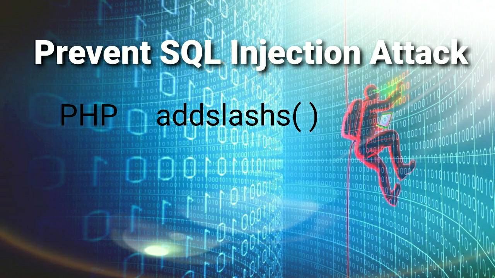
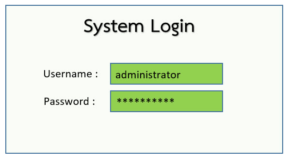
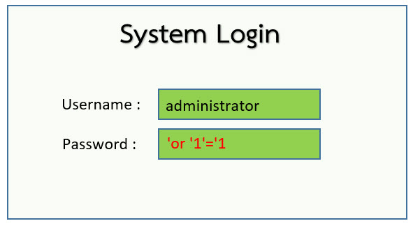

<h1>addslashs() function</h1> 
 
 ฟังก์ชัน addslashes() ใน PHP เป็นฟังก์ชันที่ใช้จัดรูปแบบข้อความใหม่โดยการเพิ่ม backslash (\) ข้างหน้าตัวอักษรดังนี้  
 - single quote(‘) 
 - double quote(“)
 - backslashes(\) 
 - NULL 
 เพื่อป้องกันความผิดพลาดหรือป้องกันการใช้งานผิดวัตถุประสงค์จากผู้ไม่ประสงค์ดี  
<h2> ทำไมต้องใช้ฟังก์ชัน addslashes()</h2>
 PHP มีฟังก์ชันพิเศษคือ ฟังก์ชัน addslashes() สำหรับจัดรูปแบบตัวอักษรใหม่ ก่อนการเขียนลง database 
 เพื่อป้องกันการเกิด SQL Injection โดย SQL Injection คือการใช้คำสั่งหรือแฝงคำสั่ง SQL จากการรับค่าของผู้ใช้ไปทำการ  query, insert, update, delete หรืออื่นๆ บน Database 
 ตัวอย่างของ SQL Injection เช่นมีการรับค่า input จากผู้ใช้งานเป็น username และ password เพื่อ Login ระบบ
 
แสดงการใส่ข้อมูล Login ปกติ
 
แสดงการใส่ข้อมูล Login โดยใช้คำสั่ง SQL
 ตัวอย่าง code ของการ query ข้อมูล username และ password ดังนี้
 $username = $_POST['usernameInput'];
 $password = $_POST['passwordInput'];
 $sql = "SELECT username FROM Users where username='$username' AND password='$password';"
 $result = $conn->query($sql);
 ซึ่งจะเห็นว่ารูปที่ 2 เป็นการ bypass เข้าระบบได้โดยไม่ต้องใส่ password
<h3> การเรียกใช้ ฟังก์ชัน addslashes()
 $username = addslashes(trim($_POST['user']));
 $password= addslashes(trim($_POST['pwd']));
 เพียงเท่านี้ก็สามารถป้องกัน SQL injection ที่เป็นการ bypass username และ password ได้แล้ว
