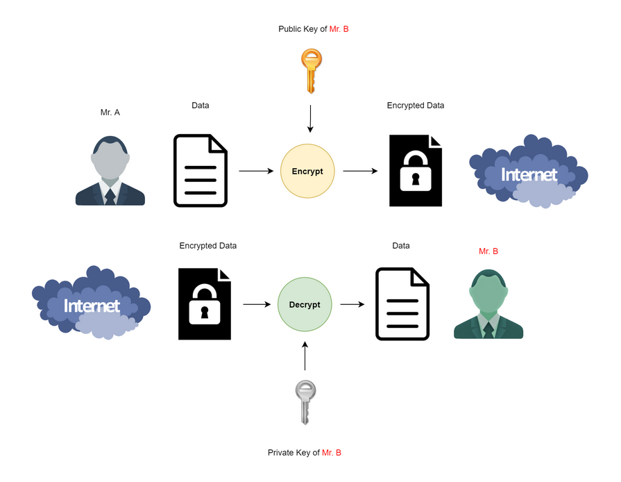

# openssl_public_encrypt()
`openssl` `openssl_public_encrypt` `encryption` 


`openssl_public_encrypt` เป็นการเข้ารหัสลับคล้ายๆ กับ `openssl_encrypt` แต่ส่วนที่เพิ่มเติมคือมีการใช้ Public Key เข้ามาเกี่ยวข้อง
การเข้ารหัสแบบ `Public Key` จะเป็นแบบ `Asymmetric` ซึ่งทำให้มีคีย์ที่เกี่ยวข้องอยู่ 2 Key คือ `Public Key` และ `Private Key`
โดยข้อมูลที่เข้ารหัสด้วย `Public Key` ต้องถอดรหัสด้วย `Private Key` ที่เข้าคู่กันเท่านั้น 
นั้นหมายความว่า ทุกคนเห็นข้อมูลที่เป็น `ciphertext` แต่จะมีคนที่มี `Private Key` เท่านั้นที่สามารถอ่านออก




## รูปแบบการใช้ function openssl_public_encrypt()
````PHP
openssl_public_encrypt ( string $data , string &$crypted , mixed $key , int $padding = OPENSSL_PKCS1_PADDING ) : bool
````
## พารามิเตอร์ 
|  Parameter  |                     Description                           |
|-------------|---------------------------------------------------------|
|data       |.                      |
|encrypted          |It will have the data that is encrypted.             |
|  key           |            The public key.         |
|     padding        |  The padding you can apply are : OPENSSL_PKCS1_PADDING, OPENSSL_SSLV23_PADDING, OPENSSL_PKCS1_OAEP_PADDING, OPENSSL_NO_PADDING.      |

### ตัวอย่างการใช้ openssl_public_encrypt()
````PHP
<?php
$bool = openssl_public_encrypt ("this is some data",$crypted,"file:///tmp/public-key.pem",OPENSSL_PKCS1_PADDING);

// shows the result in base64 and decrypted
if ($bool) 
{
    $base64 = base64_encode($crypted);
    $d_bool = openssl_private_decrypt(
        $crypted,
        $decrypted,"file:///tmp/private-key.pem",OPENSSL_PKCS1_PADDING);
}
?>
````
### ผลลัพธ์
````PHP

$crypted	=	'Guև�X��̉�8"-E�U��N�' . "\0" . '���Bd��|5�E�j4��Ë&}��”�gJ����]l\\��n`��`��z���S�l��c�x�}-�V�)\\D�,M*�(ex0�C�i�o-\\\\�$��yRg��8o#3��t� 6�E�3�UH�K"��' . "\0" . '&�w���8�|Y8�`�YZ�VIQ�O�<㟆F(�
P���&��W^ ���Ɉ�>�#J��[�l�r���s�-6*z��?�C^ͧ&��KK+�'
$bool	=	true
$base64	=	'R3XWh/RY8JTwssyJBqs4Ii0HRYdVH9rPTuKXAJiOokJk5+B8NZIUReVqNJLVw4smfYXKwpSLZ0rAqtEG6KldbBpcp51uYBrsERKjFGDA7XqtE+/XUx/FbKWJBwhj6AZ4/30tzlbnKVwIRKcsHk0q3yhlE3gw1UO5acdvLRZcXMUkkOF5BFJnm+GqOBQSbyMztBbJdJkNNqdF3DPtVUi/SyKb6gAmoHeyxdI4snxZOPO6pmCrAlla21ZJUYRPmzzjn4ZGKO4KUMCaGvsm+9RXXiC3offJiM8+GbQjShnfEKJb6GyHcrO4FONzDpMtNip6maA/BPNDXs2nJv33S0srmg=='
$d_bool	=	true
$decrypted	=	'this is some data'
````

### References:
- https://www.php.net/manual/en/function.openssl-public-encrypt.php
- http://micmap.org/php-by-example/en/function/openssl_public_encrypt
- https://www.tutorialspoint.com/php/php_function_openssl_public_encrypt.htm

