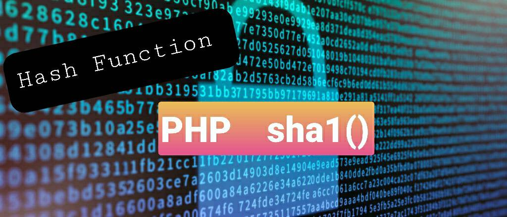

# Hash PHP Function

## sha1() Function


Function Hash ใน PHP ไม่ได้มีแค่ md5() อย่างเดียวยังคงมี sha1() หรือชื่อเต็มของเค้าคือ Secure Hash Algorithm 1
โดย sha1 จะมี Message Digest เท่ากับ 160 bits 

### รูปแบบการใช้ sha1()
````PHP
sha1(string,raw);
````

### ตัวอย่างการใช้ sha1()
````PHP
<?php
echo sha1(Nantawan);
?>
````

### ผลลัพธ์
````PHP
a1f424837871e4277419716a6aeecb2d1e81917f
````

ปัจจุบันการ hash ข้อมูลไม่แนะนำให้ใช้ทั้ง md5 และ sha1 แล้วเพราะ sha1 สามารถทำ Rainbow Table Crack
และยังพบว่ามีการชนกันของ sha1 ซึ่งทำให้ Hash Function แบบ sha1 ไม่น่าเชื่อถือ

## References:
- https://www.php.net/manual/en/function.sha1.php

## Warning
`It is not recommended to use this function to secure passwords, due to the fast nature of this hashing algorithm. See the Password Hashing FAQ for details and best practices.`
